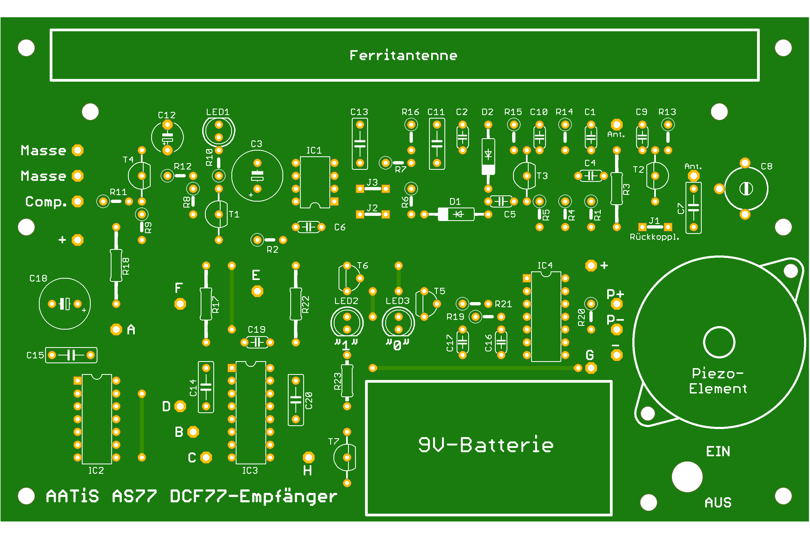
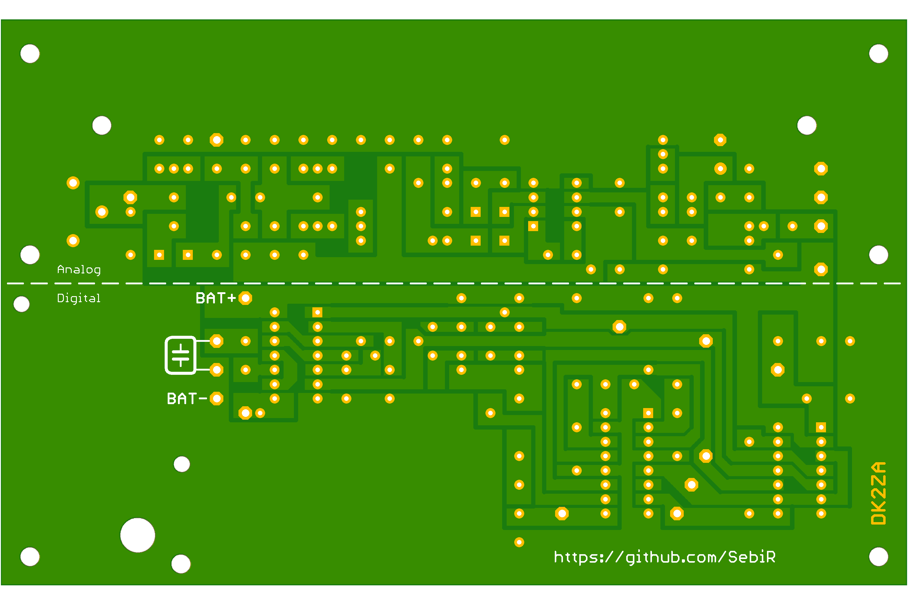

# AATiS DCF77 Empfänger

This is a clone of the original AATiS AS77 DCF77 Receiver board.

This project was the very first electronic kit that I assembled when I was eleven or twelve years old and it basically started my career as an EE.\
The receiver I built back then still functions to this day and as the design itself celebrates its 30th birthday in this year, I wanted to preserve it for generations to come as the original PCB has been discontinued.

## Description

* Mechanical 99.9% identical to the original board
* Layout 99.9% identical to original layout

## Status Quo
* Layout basically finished
* Schematic still a mess
* Library needs cleaning up

## Disclaimer
> [!CAUTION]
> This project was created to archive and preserve the DCF77 receiver. AATis/Helmut Pape own all the rights to this design.
> There's no copyright infringement intended, please contact me for removal.